# Voice Order System

## Overview
Voice Order System is an innovative application that uses Azure AI services to streamline the restaurant ordering process through voice recognition and natural language understanding. This project was developed for the Azure AI Developer Hackathon, leveraging GitHub Copilot and Azure AI services to create a seamless voice-to-invoice solution.

## Key Features
- Real-time speech-to-text processing using Azure Speech Services
- Natural language understanding with Azure AI Language for intent recognition
- Interactive order management across three intuitive pages
- Voice command processing for adding, updating, and removing items
- Order history tracking with status updates
- Menu scanning functionality to extract items from images or PDFs
- Responsive design that works across devices

## Technology Stack
- **Frontend**: React with modern JavaScript (ES Modules)
- **Backend**: Node.js with Express
- **Database**: MongoDB for menu and order storage
- **Azure Services**: 
  - Speech-to-Text API
  - Language Understanding Service
  - Form Recognizer / Document Intelligence 
  - Azure OpenAI Service
- **Development Tools**: GitHub Copilot with VS Code

## How GitHub Copilot Enhanced Development
GitHub Copilot significantly accelerated our development process by:
- Generating boilerplate code for Azure AI service integration
- Suggesting implementation patterns for intent recognition
- Helping implement real-time transcript updates with proper event handling
- Creating responsive CSS for our user interface components
- Assisting with MongoDB schema design and query optimization

## Application Flow

### New Order Page
- **Menu Display** at the top with search and filter capabilities
- **Voice Order Button** activates speech-to-text functionality
- **Real-time Transcript** shows your speech as you speak
- Order confirmation sends data to backend for processing
- Backend extracts details and saves to database

### Order History Page
- **Order Listing** with most recent orders at the top left
- **View Invoice** option for detailed order information
- Three action buttons available:
  - **Edit Button** opens Edit Order page
  - **Confirm Button** changes status from pending to confirmed
  - **Delete Button** removes order from history

### Edit Order Page
- **Order Details View** shows current order information
- **Voice Command Button** activates Azure AI speech recognition
- Azure Language API processes speech to identify:
  - Intent (update quantity, add items, remove items)
  - Item names and quantities
  - Negations ("not", "don't", etc.)
- Supports natural language commands like:
  - "Remove the cheeseburger" 
  - "Please remove the cheeseburger"
- **Save Changes Button** commits changes to database
- Returns to Order History Page after saving

### Menu Scanner Page
- Upload menu images or PDFs with clear instructions
- Azure Form Recognizer extracts text from the document
- Azure OpenAI processes the text to identify menu items, prices, descriptions, and categories
- Interactive editor for reviewing and modifying extracted items
- Save functionality to add items to the restaurant's menu database

## Project Structure
```
voice-order-system/
├── backend/               # Node.js Express API
│   ├── models/            # MongoDB schemas
│   ├── routes/            # API endpoints
│   ├── utils/             # Processing utilities
│   └── server.js          # Server configuration
├── frontend/              # React application
│   ├── public/            # Static assets
│   └── src/               # React components
│       ├── pages/         # Application pages
│       ├── hooks/         # React hooks for state and API
│       ├── utils/         # Voice command and order processing utilities
│       ├── components/    # Reusable UI components
│       └── App.js         # Main application
└── README.md              # Project documentation
```

## Architecture Diagram

```mermaid
flowchart TD
    classDef pageBg fill:#f0f8ff,stroke:#2980b9,stroke-width:2px
    classDef azureBg fill:#e6f7ff,stroke:#0078d4,stroke-width:2px
    classDef backendBg fill:#f9f9f9,stroke:#2c3e50,stroke-width:2px
    classDef mainProcess fill:#d4f1f9,stroke:#3498db,stroke-width:1px,color:#333,font-weight:bold
    classDef subProcess fill:white,stroke:#95a5a6,stroke-width:1px,color:#333
    classDef apiCall fill:#ffe6cc,stroke:#e67e22,stroke-width:1px,color:#333
    classDef azureService fill:#cce5ff,stroke:#0078d4,stroke-width:1px,color:#333,font-weight:bold
    classDef azureFeature fill:#e6f2ff,stroke:#4da6ff,stroke-width:1px,color:#333
    classDef actionButton fill:#d5f5e3,stroke:#27ae60,stroke-width:1px,color:#333,font-weight:bold
    
    subgraph "New Order Page"
        A1["📋 Menu Display"]:::mainProcess --> A2["🔍 Search & Filter"]:::subProcess
        A3["🎤 Voice Order Button"]:::actionButton --> A4["🔊 Speech Recognition Hook"]:::subProcess
        A4 --> A4a["☁️ Connect to Azure"]:::apiCall
        A4a --> A5["📝 Real-time Transcript"]:::subProcess
        A5 --> A6["✅ Order Confirmation"]:::mainProcess
        A6 --> A7["📤 API Call to Backend"]:::apiCall
    end
    
    subgraph "Azure AI Services"
        E0["🔊 Azure AI Speech Service"]:::azureService
        E1["🧠 Azure AI Language Service"]:::azureService
        E2["🎯 Intent Recognition"]:::azureFeature
        E3["🏷️ Entity Extraction"]:::azureFeature
        E4["📑 Form Recognizer Service"]:::azureService
        E5["🤖 Azure OpenAI Service"]:::azureService
        
        E0 --> E01["👂 Speech Recognition"]:::azureFeature
        E01 --> E02["📄 Text Extraction (e.result.text)"]:::azureFeature
        
        E1 --> E2
        E1 --> E3
        
        E3 --> E31["🔢 ItemQuantity"]:::subProcess
        E3 --> E32["🍔 ItemName"]:::subProcess
        E3 --> E33["📏 ItemSize"]:::subProcess
        E3 --> E34["❌ Negation Detection"]:::subProcess
        
        E2 --> E21["🔄 Update Quantity Intent"]:::subProcess
        E2 --> E22["➕ Add Item Intent"]:::subProcess
        E2 --> E23["➖ Remove Item Intent"]:::subProcess
        
        E4 --> E41["🔍 Document Analysis"]:::azureFeature
        E41 --> E42["📝 OCR Text Extraction"]:::azureFeature
        
        E5 --> E51["📊 Menu Structure Analysis"]:::azureFeature
        E5 --> E52["🏷️ Menu Item Classification"]:::azureFeature
    end
    
    subgraph "Backend Processing"
        B1["⚙️ Process Order Script"]:::mainProcess
        B2["📋 Extract Order Details"]:::subProcess
        B3["💾 Database Recording"]:::mainProcess
        
        B1 --> B2
        B2 --> B3
    end
    
    subgraph "Order History Page"
        C1["📋 Order Listing"]:::mainProcess --> C2["⏱️ Latest Order First"]:::subProcess
        C1 --> C3["🧾 View Invoice"]:::subProcess
        C1 --> C4["⚙️ Order Actions"]:::mainProcess
        C4 --> C41["✏️ Edit Button"]:::actionButton
        C4 --> C42["✅ Confirm Button"]:::actionButton
        C4 --> C43["🗑️ Delete Button"]:::actionButton
        C42 --> C421["📝 Change Status to Confirmed"]:::subProcess
        C43 --> C431["❌ Remove from Order History"]:::subProcess
    end
    
    subgraph "Edit Order Page"
        D1["📄 Order Details View"]:::mainProcess
        D2["🎤 Voice Command Button"]:::actionButton
        D3["🔊 Speech Recognition Hook"]:::subProcess
        D3a["☁️ Connect to Azure"]:::apiCall
        D4["🧠 Azure Language API Call"]:::apiCall
        D5["💾 Save Changes Button"]:::actionButton
        D6["📝 Temporary Order Changes"]:::mainProcess
        D7["🎯 Process Intent Results"]:::subProcess
        D8["🏷️ Process Entity Results"]:::subProcess
        D9["⚙️ Voice Command Processing Util"]:::mainProcess
        
        D2 --> D3
        D3 --> D3a
        D3a --> D4
        D4 --> D9
        D9 --> D7
        D9 --> D8
        D7 --> D6
        D8 --> D6
        D6 --> D5
    end
    
    subgraph "Menu Scanner Page"
        M1["📷 Upload Menu Image/PDF"]:::actionButton
        M2["📋 Form Recognizer Processing"]:::mainProcess
        M3["🧠 OpenAI Analysis"]:::mainProcess
        M4["📝 Menu Item Review"]:::subProcess
        M5["✏️ Edit Item Details"]:::actionButton
        M6["💾 Save to Menu Database"]:::actionButton
        
        M1 --> M2
        M2 --> M3
        M3 --> M4
        M4 --> M5
        M5 --> M4
        M4 --> M6
        M6 --> B3
    end
    
    %% Main flow connections
    A7 --> B1
    B3 --> C1
    C41 --> D1
    D5 --> B3
    D5 -.-> C1
    
    %% Azure AI connections
    A4a -.-> E0
    D3a -.-> E0
    E02 -.-> A5
    E02 -.-> D4
    D4 -.-> E1
    E2 -.-> D7
    E3 -.-> D8
    M2 -.-> E4
    E42 -.-> M3
    M3 -.-> E5
    E52 -.-> M4
    
    %% Status flow
    C421 --> B3
    C431 --> B3
```


## Future Enhancements
- Add multi-language support using Azure Translator
- Implement Azure Text Analytics for sentiment analysis of customer feedback
- Create a restaurant management dashboard with ordering analytics
- Integrate payment processing through Azure Functions
- Add image recognition for visual menu items using Azure Computer Vision

## Demo
[Watch our demo video](https://youtu.be/9CZqfIcfH0k?feature=shared)

## Installation & Setup

### Prerequisites
- Node.js 18+
- MongoDB
- Azure Speech Services account
- Azure Language Understanding Service
- Azure Form Recognizer Service
- Azure OpenAI Service
- GitHub Copilot access

### Getting Started
1. Clone this repository
2. Set up environment variables (see `.env.example`)
3. Install dependencies
   ```
   cd backend && npm install
   cd frontend && npm install
   ```
4. Run the development servers
   ```
   # Backend
   cd backend && npm run seed && npm run dev
   
   # Frontend
   cd frontend && npm run dev
   ```

## Hackathon Submission
This project was created for the Azure AI Developer Hackathon.

